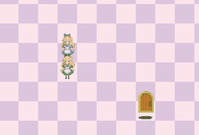
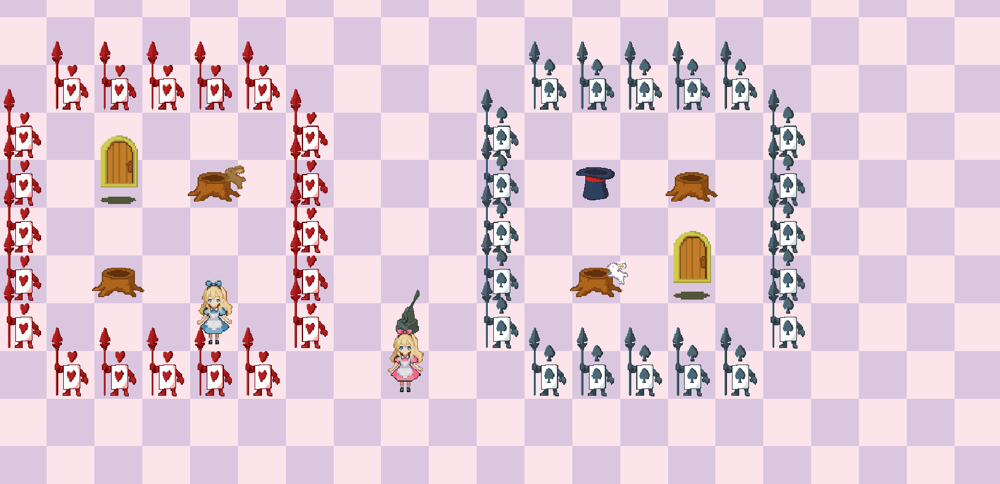

# 게임 소개

---

**게임 제목: 앨리스의 이상한 나라**

---

**게임 장르: 2D, 탑뷰 퍼즐**

이상한 나라의 앨리스가 재밌는 퍼즐을 풀어 헤쳐나간다!

# 구현하고자 한 재미

<aside>

### 🧐 논리적 사고를 하는 재미

### 💡 복잡한 문제를 해결하는 순간의 쾌감

</aside>

# 의도한 플레이 방법

<aside>

### 논리적으로 생각하며 퍼즐 풀이

### 복잡한 문제에 몰입하며 플레이

</aside>

---

# 게임 구성

### 캐릭터

### 파란 앨리스

유저가 누른 방향으로 이동

### 빨간 앨리스

유저가 누른 반대 방향으로 이동

### 초록 앨리스

스스로 이동하지 못한다. 다른 앨리스로 밀어 이동할 수 있다. 

### **게임 클리어!**

모든 문에 앨리스가 동시에 들어가면 게임 클리어

### 다양한 기믹 타일

### → 창의적이고 복잡한 퍼즐의 재료

### 퍼즐

얼핏 보이는대로 하면 **실패**

논리적 사고를 해야 풀리는 퍼즐

**→ 논리적 사고를 하는 재미**

---

# 레벨 디자인

칙센트미하이의 몰입 이론

### 1. 상승하는 플레이어의 실력과 퍼즐 난이도

### 2. 비선형 스테이지 구성

### 조작법

조작 - 키보드, 마우스

기본 조작: WASD

다시하기: R

메뉴: ESC

### 제작 회고

| 좋았던 점 | 아쉬운 점 |
| --- | --- |
| 게임의 여러 기믹이 컨셉에 잘 어울어졌다. | 도트 해상도가 최소 512x512 / 512 x 768 등 진심이 담겨있는데실제 게임에서는 작게 표현되어 원래 화질에 비해 잘 보이지 않는다 |
| 퍼즐 레벨 디자인에 대해 공부할 수 있어서 좋았다. | 미리 준비하지 않아서 마감에 쫓겨 마무리했다 |
